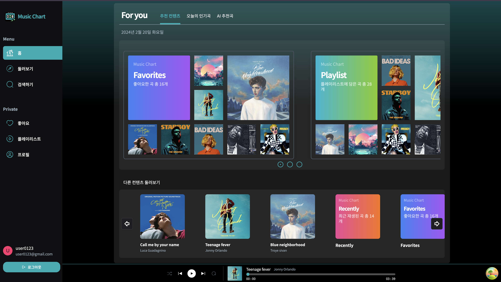
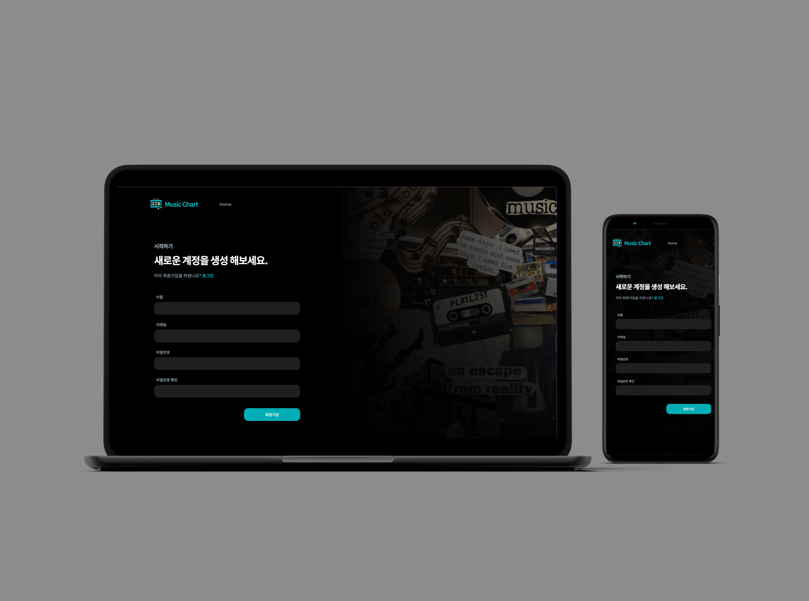

## 🎧 음악과 관련 기능 제공 앱 Music Chart 

 

* 배포 URL: 
* Test ID: Admin@gmail.com
* Test PW: Admin123!

 
 
 

## 프로젝트 소개
- 프로젝트 주제 : 음악 스트리밍 어플리케이션

- 프로젝트 개요 : 풀 스택 개발을 경험해보고 싶은데 무난한 게시판이나 쇼핑몰보다는 좋아하는 음악을 주제로 간단한 서비스를 만들고자 했다. Music Chart는 스포티파이, 멜론, 지니 등 일반적인 음원 스트리밍 사이트의 가장 기본적인 기능들을 구현하는데 노력했다. 프론트엔드의 입장에서 백엔드와 소통하는 방법을 배우고자 진행한 프로젝트 였다. 때문에 프론트 부분에 더 많은 시간을 투자하기 위해 백엔드는 'Appwrite'라는 백엔드 라이브러리를 사용해서 세션, 인증, 인가, DB 등 백엔드와 관련된 다양한 기능들을 직접 구현하지 않고 사용했으며, 프론트와 통신했다. 

- 전체 개발 기간 : 2023.11.28 ~ 2024.02.12

 

## [ 기술 스택 ]

| JavaScript | TypeScript |   HTML   |   Appwrite  |   React   |   React-query  |   Tailwind  |
| :--------: | :--------: | :------: | :---------: | :-------: | :------------: | :---------: |
|   ![js]    |   ![ts]    | ![html]  | ![appwrite] |  ![react] |  ![react-query] | ![tailwind] |

 
 
 

## 페이지 또는 UI별 기능
[ 회원가입 ]
- 프론트엔드
  - 회원가입을 위해 사용자에게 이름, 이메일, 비밀번호, 확인 비밀번호 값을 입력 받음
  - '회원가입' 버튼을 클릭하면, 백엔드에 DB에 유저 정보를 저장해달라는 API 요청을 보냄
  - 단, 이름이 2자리 이하거나, 이메일 값의 이메일 양식에 어긋나거나, 비밀번호가 8자리 이하거나, 비밀번호와 확인 비밀번호 값이 다르면 API 요청을 보내지 않고 각 필드 아래에 경고문을 띄움
  - API 요청을 성공적으로 보낸 경우, 로직을 처리 중이라는 사실을 사용자가 알 필요가 있다. 따라서 로직을 처리하는 동안은 기존 회원가입 버튼의 '회원가입'을 '로딩 중'으로 바꿈
  - API 요청은 useCreateUserAccount 쿼리를 통해서 보냄
  - 응답으로 유저 정보를 받은 경우, 성공 했다는 뜻이니 로그인 페이지로 라우팅해서 로그인 유도

- 백엔드
  - 요청을 받으면, Auth에 유저 정보를 저장
  - 참고로 appwrite에서 Auth는 세션 관리, 비밀번호 암호화 등 인증, 인가에 관련된 기능들을 제공한다. Auth와 DB에 각각 별도로 유저 정보 저장
  - appwrite의 avatars의 getInitials 메서드를 통해 임시 유저 프로필 이미지를 생성
  - DB의 user collection에 해당 유저 정보를 저장한다. 이때 비밀번호 내용은 뺌
  - 성공적으로 로직을 모두 수행 시, 응답으로 DB에 저장된 유저 정보를 반환

 

[ 로그인 ]
- 프론트엔드
  - 사용자에게 이메일, 비밀번호 값을 입력 받음
  - '로그인' 버튼을 클릭하면 백엔드에 인증과 인과를 요청하는 API 요청을 보냄
  - API 요청을 처리 중이면, 버튼의 텍스트가 '로딩 중'으로 바뀜
  - API 요청은 useLoginAccount 쿼리를 통해서 보냄
  - 응답으로 세션을 받았다면, 전역에 유저 상태 저장하고 로그인 성공 알림창과 홈페이지로 라우팅
  - 이때 전역 상태는 Context API 사용해서 관리
  - 세션을 받지 못한 경우, 로그인에 실패했다는 알림창을 띄움

- 백엔드
  - 요청을 받으면, createEmailSession 메서드를 통해 세션을 생성한다. 
  - 등록된 이메일이 아니면 세션이 생성되지 않기 때문에 인증 구현 가능
  - 생성된 세션은 사용자의 인증을 서버에서 원격으로 제어할 수 있으며, 인증이 필요한 서비스 이용에 사용되니 인가도 구현됨
  - 결론적으로 세션은 인증과 인가 로직을 한꺼번에 처리함
  - 응답으로 세션을 보냄

[ 네비게이션 ]
- 프론트엔드
  - 사용자에게 원하는 기능을 사용할 수 있게 라우팅 기능이 담긴 메뉴들을 보여줌
  - 전역 상태인 user에는 isAdmin이라는 불리언 타입 값이 있는데, 이것은 관리자 인지 아닌지 나타냄
  - isAdmin이 true인 경우, 관리자이므로 관리자에게만 보이는 '새로운 곡 추가' 메뉴가 보임
  - 사용자가 로그아웃을 클릭 할 경우, 전역 상태인 user에 저장된 값을 초기화하고, 로그인 페이지로 라우팅

### 03. 홈 페이지

### 04. 곡 정보 추가 페이지

### 05. 곡 정보 수정 페이지

### 06. 둘러보기 페이지

### 07. 좋아요리스트 페이지

### 08. 플레이리스트 페이지

### 09. 프로필 페이지

### 10. 프로필 정보 수정

### 11. 오디오 컨트롤러

 

<!-- Stack Icon Refernces -->

[js]: public/assets/icons/javascript.svg
[ts]: public/assets/icons/typescript.svg
[react]: public/assets/icons/react.svg
[html]: public/assets/icons/html.svg
[tailwind]: public/assets/icons/tailwind.svg
[appwrite]: public/assets/icons/appwrite.png
[react-query]: public/assets/icons/react-query.svg
